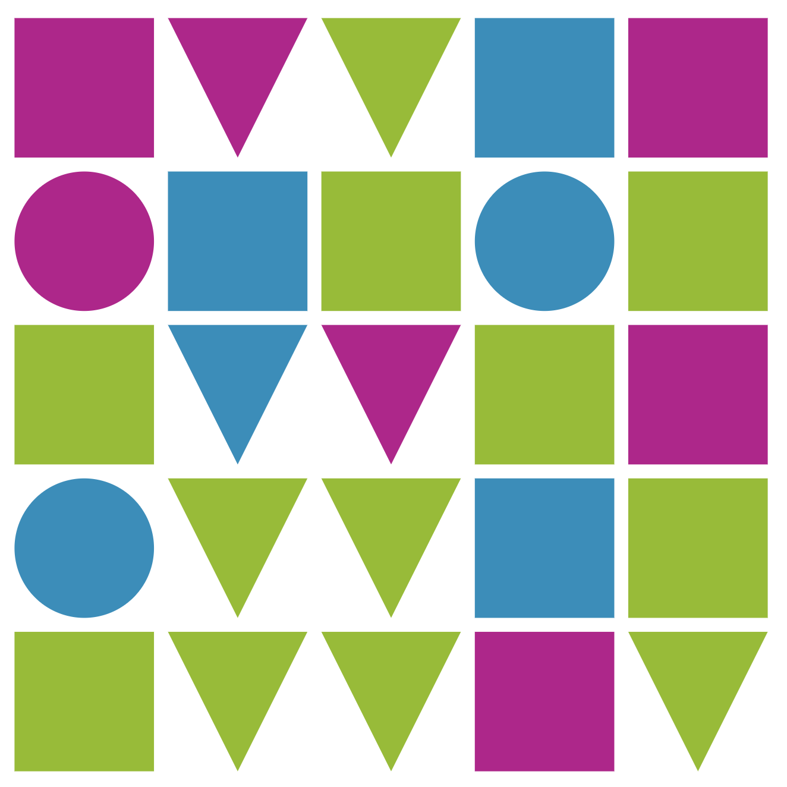

# Shape Keyboard

This repository is part of a Thing-a-Week challenge. This week’s theme is:

> something musical

Click the shapes to play notes. Shapes and colors are random; shapes affect the note’s waveform (circle = sine, triangle = sawtooth, square = square). Even rows form a pentatonic scale and odd rows add chromatics, so really all notes are present except A♯/B♭.

**Demo:** [tboronczyk.github.io/taw-music/src/index.html](https://tboronczyk.github.io/taw-music/src/index.html)

---

